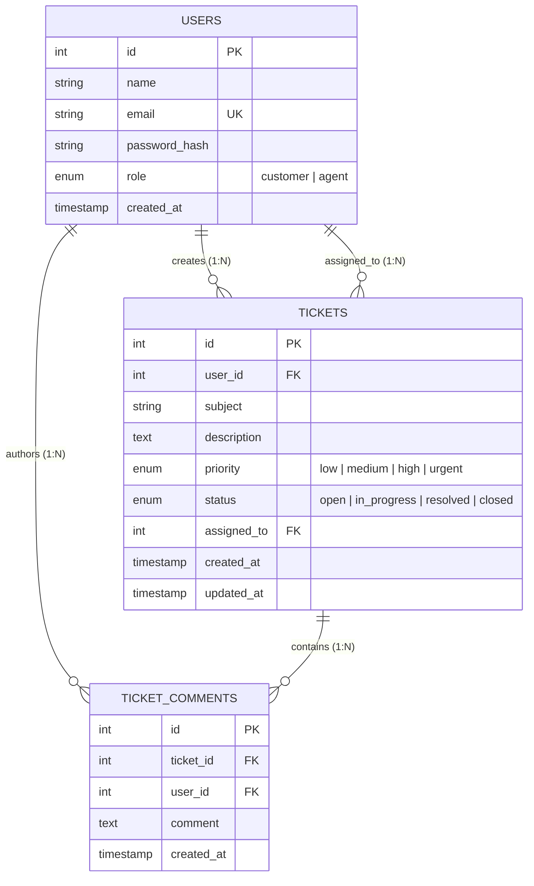

# Support Ticket Management System 🎫

[](https://nodejs.org/)
[](https://expressjs.com/)
[](https://react.dev/)
[](https://tailwindcss.com/)
[](https://www.mysql.com/)
[](https://jwt.io/)
[](https://jestjs.io/)

A full-stack web-based **Support Ticket Management System** built for technical assessment. The application provides a customer support portal where customers can submit tickets, track issue resolutions, and communicate with support agents, while support agents can manage queues, update priorities and statuses, assign tickets, and post official responses.

---

## 🌐 Live Deployed Application URLs

- **Primary Live Public Application (Cloudflare Edge)**: [https://captured-advised-vacuum-nicholas.trycloudflare.com](https://captured-advised-vacuum-nicholas.trycloudflare.com)
- **Alternative Mirror (Localtunnel)**: [https://all-walls-leave.loca.lt](https://all-walls-leave.loca.lt)
- **Live Health & Service Check**: [https://captured-advised-vacuum-nicholas.trycloudflare.com/api/health](https://captured-advised-vacuum-nicholas.trycloudflare.com/api/health)
- **Requirement 8 Live SQL Query Endpoint**: [https://captured-advised-vacuum-nicholas.trycloudflare.com/api/example-query](https://captured-advised-vacuum-nicholas.trycloudflare.com/api/example-query)

---

## 📌 Table of Contents
1. [Core Features & Role Capabilities](#-core-features--role-capabilities)
2. [Technology Stack](#-technology-stack)
3. [Database Schema & Architecture](#-database-schema--architecture)
4. [Requirement 8: Example Database Query (SQL JOIN)](#-requirement-8-example-database-query-sql-join)
5. [REST API Documentation](#-rest-api-documentation)
6. [Demo Accounts](#-demo-accounts)
7. [Local Development Setup](#-local-development-setup)
8. [Automated Testing](#-automated-testing)
9. [Postman Collection Guide](#-postman-collection-guide)
10. [Docker Compose Deployment](#-docker-compose-deployment)
11. [Cloud Deployment Guide](#-cloud-deployment-guide)

---

## 🚀 Core Features & Role Capabilities

### 1. Authentication & Security
- **JWT-Based Authentication**: Secure stateless token issuance and verification via `Authorization: Bearer <token>`.
- **Password Hashing**: Secure salted bcrypt hashing (`cost factor: 10`); passwords are never stored in plaintext.
- **Strict Role-Based Access Control (RBAC)**: Distinct authorization middleware protecting customer and agent routes.
- **SQL Injection Prevention**: Parameterized queries across all database operations.
- **CORS Protection**: Explicitly configured cross-origin resource sharing headers.

### 2. Customer Portal
- **Ticket Dashboard**: Overview cards displaying total, open, in-progress, and resolved tickets.
- **Raise Tickets**: Form with client-side validation for subject, priority (`low`, `medium`, `high`, `urgent`), and detailed description.
- **Ticket Thread & History**: Real-time view of ticket details and chronological responses.
- **Add Comments**: Direct replies to support agents on ongoing tickets.
- **Search & Filter**: Instant search by subject keyword and filter by ticket status.
- **Privacy Enforcement**: Strict scoping ensuring customers can **never** view or alter another customer's tickets.

### 3. Support Agent Workspace
- **Queue Overview**: Live KPI statistics bar (Total, Open, In Progress, Resolved, Urgent, Unassigned).
- **Global Ticket Queue**: View, search, filter, and sort across all tickets across all customers.
- **Inline Triage**: Rapid inline status change (`open`, `in_progress`, `resolved`, `closed`) and priority updates.
- **Ticket Assignment**: Assign tickets to specific support agents from an active agents roster.
- **Official Responses**: Post support replies to customers (automatically changes status from `open` to `in_progress`).

---

## 🛠 Technology Stack

| Layer | Technology | Details |
|---|---|---|
| **Frontend** | React 18, Vite 5, Tailwind CSS | Single Page App, Responsive UI, Lucide Icons, Axios |
| **Backend** | Node.js, Express.js | REST APIs, JWT, BcryptJS, CORS, Parameterized SQL |
| **Database** | MySQL 8.0 / MySQL2 | Relational schema, foreign keys, cascade rules, indexes |
| **Testing** | Jest, Supertest | 14 automated end-to-end integration and security tests |
| **API Testing** | Postman | Complete v2.1 collection covering all endpoints & errors |
| **Containers** | Docker & Docker Compose | Multi-container orchestration (MySQL + Backend + Frontend) |

---

## 🗄 Database Schema & Architecture

The database architecture consists of three related tables in MySQL (`support_ticket_db`):



### Table Definitions & Indexes
1. **`users`**:
   - `id` (INT AUTO_INCREMENT PRIMARY KEY)
   - `name` (VARCHAR(100) NOT NULL)
   - `email` (VARCHAR(191) NOT NULL UNIQUE)
   - `password_hash` (VARCHAR(255) NOT NULL)
   - `role` (ENUM('customer', 'agent') NOT NULL DEFAULT 'customer')
   - `created_at` (TIMESTAMP DEFAULT CURRENT_TIMESTAMP)
   - Indexes: `idx_users_email`, `idx_users_role`

2. **`tickets`**:
   - `id` (INT AUTO_INCREMENT PRIMARY KEY)
   - `user_id` (INT NOT NULL, FK -> `users.id` ON DELETE CASCADE)
   - `subject` (VARCHAR(255) NOT NULL)
   - `description` (TEXT NOT NULL)
   - `priority` (ENUM('low', 'medium', 'high', 'urgent') DEFAULT 'medium')
   - `status` (ENUM('open', 'in_progress', 'resolved', 'closed') DEFAULT 'open')
   - `assigned_to` (INT NULL, FK -> `users.id` ON DELETE SET NULL)
   - `created_at` (TIMESTAMP DEFAULT CURRENT_TIMESTAMP)
   - `updated_at` (TIMESTAMP DEFAULT CURRENT_TIMESTAMP ON UPDATE CURRENT_TIMESTAMP)
   - Indexes: `idx_tickets_user_id`, `idx_tickets_assigned_to`, `idx_tickets_status`, `idx_tickets_priority`, `idx_tickets_status_priority`

3. **`ticket_comments`**:
   - `id` (INT AUTO_INCREMENT PRIMARY KEY)
   - `ticket_id` (INT NOT NULL, FK -> `tickets.id` ON DELETE CASCADE)
   - `user_id` (INT NOT NULL, FK -> `users.id` ON DELETE CASCADE)
   - `comment` (TEXT NOT NULL)
   - `created_at` (TIMESTAMP DEFAULT CURRENT_TIMESTAMP)
   - Indexes: `idx_comments_ticket_id`, `idx_comments_user_id`

---

## 🔍 Requirement 8: Example Database Query (SQL JOIN)

The assessment specifically mandates writing a query that returns all open tickets along with the customer's name and email, demonstrating a JOIN and filtering:

```sql
SELECT 
    t.id AS ticket_id,
    t.subject,
    t.description,
    t.priority,
    t.status,
    t.created_at,
    u.id AS customer_id,
    u.name AS customer_name,
    u.email AS customer_email
FROM tickets t
INNER JOIN users u ON t.user_id = u.id
WHERE t.status = 'open'
ORDER BY t.created_at DESC;
```

> **Live Demo**: This query is directly accessible via the API at `GET /api/example-query`, and can be inspected live in the frontend by clicking the **"SQL Join Demo"** button on the top navigation bar.

---

## 📡 REST API Documentation

### Base URL: `/api`

| Method | Endpoint | Description | Access |
|---|---|---|---|
| `POST` | `/api/auth/register` | Register new customer account | Public |
| `POST` | `/api/auth/login` | Authenticate & retrieve JWT token | Public |
| `GET` | `/api/auth/me` | Fetch authenticated user profile | Authenticated |
| `GET` | `/api/tickets` | List tickets (Customer: own tickets; Agent: all) | Authenticated |
| `POST` | `/api/tickets` | Create a new ticket | Customer |
| `GET` | `/api/tickets/stats/summary`| Agent dashboard queue statistics | Support Agent |
| `GET` | `/api/tickets/:id` | Get ticket details and assigned agent | Authorized user |
| `PUT` | `/api/tickets/:id` | Update status, priority, or assignee | Agent / Owner |
| `DELETE`| `/api/tickets/:id` | Delete ticket (owner if open, or agent) | Authorized user |
| `GET` | `/api/tickets/:id/comments`| Get chronological comments thread | Authorized user |
| `POST`| `/api/tickets/:id/comments`| Post comment / agent response | Authenticated |
| `GET` | `/api/users` | List users/agents (`?role=agent`) | Support Agent |
| `GET` | `/api/example-query` | Requirement 8 SQL JOIN demonstration | Public |
| `GET` | `/api/health` | Service health status check | Public |

---

## 👤 Demo Accounts

The database comes pre-seeded with ready-to-test accounts. The login screen also includes **1-click login buttons** for instant evaluation:

| Role | Email | Password |
|---|---|---|
| **Customer** | `customer@demo.com` | `Customer123!` |
| **Customer (Alice)** | `alice@demo.com` | `Customer123!` |
| **Support Agent (Bob)** | `agent@support.com` | `Agent123!` |
| **Support Agent (Sarah)** | `sarah@support.com` | `Agent123!` |

---

## 💻 Local Development Setup

### Prerequisites
- Node.js (v18.0.0 or higher)
- npm (v9.0.0 or higher)
- MySQL Server (v8.0) *OR use automatic SQLite fallback mode*

### 1. Clone the Repository
```bash
git clone https://github.com/your-username/support-ticket-system.git
cd support-ticket-system
```

### 2. Backend Setup
```bash
cd backend
npm install
```

Configure your environment variables by creating `.env`:
```env
PORT=5000
NODE_ENV=development
JWT_SECRET=super_secret_jwt_key_support_ticket_2026

# MySQL Database Settings
DB_HOST=localhost
DB_PORT=3306
DB_USER=root
DB_PASSWORD=your_mysql_password
DB_NAME=support_ticket_db

# (Optional) If you do not have MySQL installed locally:
USE_SQLITE=false
```

Execute Database Migrations & Seeds:
```bash
# Option A: Via MySQL CLI
mysql -u root -p < ../database/schema.sql
mysql -u root -p < ../database/seed.sql

# Option B: Via npm seed command (works on MySQL and auto-fallback)
npm run seed
```

Start the Backend Server:
```bash
npm start
# Server runs on http://localhost:5000
```

### 3. Frontend Setup
In a new terminal window:
```bash
cd ../frontend
npm install
npm run dev
# Frontend runs on http://localhost:3000
```

---

## 🧪 Automated Testing

The backend includes a comprehensive Jest and Supertest automated test suite covering all functional, authorization, and error requirements:

```bash
cd backend
npm test
```

### Test Suite Results (14 / 14 Passing):
```
PASS tests/api.test.js
  Support Ticket Management System - End-to-End API Test Suite
    Authentication & Authorization
      ✓ 1. Valid customer registration succeeds (201)
      ✓ 2. Registration with duplicate email is rejected (400)
      ✓ 3. Valid login succeeds and returns JWT token (200)
      ✓ 4. Invalid password is rejected (401)
      ✓ 5. Unauthorized access without token is rejected (401)
    Ticket Operations & Access Control
      ✓ 6. Customer can create a new ticket (201)
      ✓ 7. Customer cannot access another customer’s ticket (403)
      ✓ 8. Support Agent can view any ticket and all tickets (200)
      ✓ 9. Support Agent can update ticket status and priority (200)
      ✓ 10. Invalid/non-existent ticket ID returns 404 (404)
    Ticket Comments & Agent Dashboard Stats
      ✓ 11. Customer can add a comment to their ticket (201)
      ✓ 12. Agent can fetch summary statistics (200)
      ✓ 13. Customer is forbidden from accessing agent statistics (403)
      ✓ 14. Requirement 8: Example JOIN query returns open tickets with customer info (200)

Test Suites: 1 passed, 1 total
Tests:       14 passed, 14 total
```

---

## 📮 Postman Collection Guide

A complete Postman collection is included at [`postman/Support_Ticket_System.postman_collection.json`](postman/Support_Ticket_System.postman_collection.json).

### How to Import & Use:
1. Open Postman.
2. Click **Import** in the upper left corner.
3. Select `postman/Support_Ticket_System.postman_collection.json`.
4. The collection is configured with automated test scripts that dynamically save tokens:
   - Running `Customer Login` automatically populates `{{customerToken}}`.
   - Running `Agent Login` automatically populates `{{agentToken}}`.
   - Running `Create New Ticket` automatically saves `{{ticketId}}`.
5. Includes tests for successful flows, 401 Unauthorized, 403 Forbidden, 400 Bad Request, and 404 Not Found.

---

## 🐳 Docker Compose Deployment

To run the entire system (MySQL 8.0, Backend API, Frontend React/Nginx) with zero configuration:

```bash
docker-compose up --build
```

- **Frontend**: http://localhost
- **Backend API**: http://localhost:5000/api
- **MySQL Database**: `localhost:3306`

---

## ☁️ Cloud Deployment Guide

The application is structured for instant zero-downtime deployment across popular free/low-cost cloud platforms:

### 1. Database Deployment (Free Managed MySQL)
- Create a free MySQL database on **Railway**, **Aiven**, or **PlanetScale**.
- Run the queries from `database/schema.sql` and `database/seed.sql` using your database provider's web console.
- Note the connection details (`DB_HOST`, `DB_PORT`, `DB_USER`, `DB_PASSWORD`, `DB_NAME`).

### 2. Backend Deployment (Render or Railway)
- Deploy the `backend/` folder as a Node.js web service on **Render** (https://render.com) or **Railway** (https://railway.app).
- Set the Build Command: `npm install`
- Set the Start Command: `npm start`
- Configure Environment Variables:
  - `PORT`: `5000`
  - `NODE_ENV`: `production`
  - `JWT_SECRET`: `<your-random-32-char-secret>`
  - `DB_HOST`, `DB_PORT`, `DB_USER`, `DB_PASSWORD`, `DB_NAME` (from Step 1)
- Copy your deployed backend URL (e.g. `https://support-ticket-api.onrender.com`).

### 3. Frontend Deployment (Vercel or Netlify)
- Deploy the `frontend/` folder to **Vercel** (https://vercel.com) or **Netlify** (https://netlify.com).
- Framework Preset: **Vite**
- Build Command: `npm run build`
- Output Directory: `dist`
- Configure Environment Variable:
  - `VITE_API_URL`: `https://support-ticket-api.onrender.com/api` (points to your deployed backend from Step 2).

---

## 📄 Assessment Compliance Checklist

- [x] **Frontend**: Built with React.js, Vite, and Tailwind CSS.
- [x] **Backend**: Node.js + Express.js REST API with input validation and clean error handling.
- [x] **Database**: MySQL schema (`schema.sql`) and sample seed (`seed.sql`).
- [x] **Authentication**: JWT token with bcrypt password hashing.
- [x] **Authorization**: Separate customer and agent role guards (403 for unauthorized access).
- [x] **Customer Scoping**: Customers cannot view or edit other customers' tickets.
- [x] **Requirement 8 Query**: Demonstrated via `GET /api/example-query` and UI modal.
- [x] **Testing**: 14 automated Jest integration tests (`npm test`).
- [x] **Postman Collection**: Fully configured with variables and test scripts.
- [x] **Docker**: `docker-compose.yml` orchestrating MySQL, backend, and frontend.
- [x] **Documentation**: Complete architecture, setup, and deployment guides.
